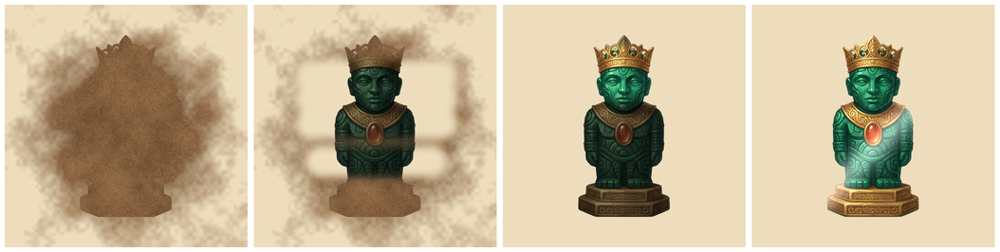

# Археоблоки — реставрация находок (идея, разбор)

Дата: 2026-09-30. Статус: **прототип готов** (очистка кистью и губкой, блеск, «Пропустить»,
сохранение). Попробовать: в debug-сборке в главном меню кнопка «Реставрация (тест)»,
или открыть `scenes/screens/restoration_screen.tscn` и нажать F6. Ещё не сделано:
вход из окна победы, коллекция с грязными/чистыми находками, сборка фрагментов, истории.

Идея: после того как находка откопана на поле, игрок **сам очищает её** — кистью снимает
грунт, потом налёт, и предмет начинает блестеть. Короткая «приятная» сцена, награда за уровень.

## 1. Нужно ли это

**Да, но коротко и по желанию игрока.**

За:

- **Это самое сильное отличие от других «блоков».** Тема раскопок сейчас живёт только
  в клетках с грунтом и в окне победы. Очистка делает находку «своей»: игрок её не просто
  получил, а откопал и отмыл.
- **Такое любят смотреть и делать.** Игры про очистку держатся на ощущении «грязно → чисто»:
  PowerWash Simulator собрал 3 млн игроков меньше чем за два месяца после выхода;
  в магазинах много мобильных «ASMR-очисток» (часы, кроссовки, мечи) с поэтапной
  очисткой разными инструментами.
- **На Яндексе такое уже играют, но без головоломки.** «Выкопай и очисти» (копать → чистить →
  музей) — оценка игроков 4.0, «Найди динозавров: раскопки» — 3.9. Головоломки с блоками,
  где потом ещё и чистишь находку, я там не нашёл.
- **Коллекция получает смысл.** Сейчас это сетка картинок. С реставрацией — полка,
  где видно, что ты сам довёл до блеска.
- **Кадры для витрины Яндекса.** Очищенная золотая маска с бликом — лучший скриншот игры.

Против:

- **Ломает темп.** Кто пришёл за блоками, не хочет каждые 2 минуты тереть экран.
  Поэтому: 15–30 секунд, кнопка «Пропустить» и очистка потом из коллекции.
- **Время разработки.** Это отдельная сцена, ввод пальцем, шейдер, звук, сохранение.
- **Можно сделать скучно.** Если чистить надо до последнего пикселя, это раздражает.
  Поэтому этап будет засчитываться примерно на 90% и дочищаться сам.

## 2. Какие бывают варианты

| Вариант | Что делает игрок | Арт | Сложность | Оценка |
| --- | --- | --- | --- | --- |
| **А. Очистка кистью** | Тянет пальцем: снимает грунт, потом налёт, в конце — блеск | Ничего нового на каждую находку: грязь и налёт рисует шейдер поверх уже готовой картинки | Средняя | **Главный вариант** |
| **Б. Сборка из фрагментов** | Перетаскивает 2–3 фрагмента на силуэт, они защёлкиваются | Нет — фрагменты уже есть (скрипт режет их сам) | Низкая | Хорошее дополнение к А для находок из 2–3 частей |
| В. Точечная раскопка | В яме аккуратно снимает грунт тапами, не задевая предмет, с ограничением ходов | Нужны своя сцена и правила | Высокая | Не сейчас: это вторая головоломка внутри головоломки |
| Г. Мастерская с таймерами | Находки ждут реставрации, ускорение за валюту | Много | Высокая | Нет: это экономика и валюты, которые по TODO не делаем до выхода |

## 3. Предложение: «Реставрация» (А + Б)

### Когда

1. Игрок откопал последний фрагмент — окно «Экспедиция завершена» показывает находку
   **грязной**, кнопки: **«Очистить находку»** (главная) и «Дальше».
2. «Очистить» открывает сцену реставрации. «Дальше» — находка попадает в коллекцию
   грязной, почистить можно позже.
3. В коллекции у грязных находок значок кисти. Нажал — та же сцена.

Бесконечный режим реставрацию не запускает, чтобы не рвать партию.

### Этапы (15–30 секунд)

1. **Сборка** (только у находок из 2–3 частей): фрагменты лежат рядом, игрок
   перетаскивает их на силуэт, они защёлкиваются с щелчком.
2. **Грунт — кисть.** Предмет под комком земли. Палец водит кистью, земля осыпается
   (частицы пыли, шуршащий звук). Этап засчитывается на 90% и дочищается сам.
3. **Налёт — губка.** Предмет тусклый, в пятнах патины. Протираешь — возвращается цвет.
   Тоже 90% и автодочистка.
4. **Блеск.** Тап — по предмету проходит блик, появляется карточка: название
   и 1–2 строки истории («Бронзовый ключ. Такими запирали кладовые храма…»).

Сверху полоска прогресса этапа, снизу кнопка «Пропустить» (сразу чистая находка).
Никаких проигрышей и таймеров — это отдых между уровнями.

### Награда

- В коллекции — чистая находка с бликом вместо грязной, счётчик «Отреставрировано 7/24».
- Монеты пока не даём: их всё равно не на что тратить (магазин после выхода).
- Рекламы в реставрации нет: это пауза-награда, а не место для рекламы.

## 4. Как сделать технически (Godot)

- **Сцена `restoration_screen.tscn`** (вёрстка в редакторе): картинка находки,
  полоска прогресса, подпись этапа, кнопки. Переиспользуется из окна победы и из коллекции.
- **Шейдер на картинке находки.** Берёт готовую чистую картинку и две маски:
  - «грунт»: плиточная текстура земли (одна картинка на всю игру) поверх предмета
    и вокруг него, с рваным краем по шуму;
  - «налёт»: тот же предмет, затемнённый и обесцвеченный, с зелёно-бурыми пятнами по шуму.
  Там, где маска стёрта, виден чистый предмет. **Отдельный «грязный» арт на каждую
  находку не нужен** — это главное, что делает идею дешёвой.
- **Кисть.** Пальцем по маске 256×256: в точке касания рисуется мягкий круг,
  маска обновляется каждый кадр. Это лёгкая операция, для веба на телефоне хватит.
  Прогресс считаем по пикселям маски, которые попадают на сам предмет
  (прозрачный фон не считается).
- **Сборка.** Фрагменты — обычные картинки, которые тащатся пальцем; защёлкиваются,
  если отпустить рядом со своим местом.
- **Сохранение.** В прогрессе и облаке: какие находки отреставрированы.
- **Звук.** Кисть (шорох, громче при движении), губка, щелчок фрагмента, блик.
  Можно сгенерировать тем же `tools/generate_sfx.py` или взять из вашей подборки.
- **Тесты.** Проведение «пальцем» по всей находке доводит этап до конца;
  «Пропустить» делает находку чистой; сохранение и облако; окно победы и коллекция
  показывают правильное состояние.

Нужен арт (Gemini, по желанию): плиточная текстура земли 512×512, иконки кисти и губки,
кадр пыли — это уже есть в пакете эффектов (`dust_puff`).

## 5. Объём и порядок

| Шаг | Что входит | Размер |
| --- | --- | --- |
| R1 | Сцена, шейдер, кисть и губка, блеск, «Пропустить», сохранение, окно победы, тесты | как M4.2 |
| R2 | Коллекция: грязные и чистые находки, значок кисти, счётчик | меньше M4.2 |
| R3 | Сборка из фрагментов | небольшой |
| R4 | Короткие истории находок (24 × RU/EN) | тексты |

Мой совет по порядку: сначала закончить арт находок в Gemini (без него реставрировать
нечего), потом **R1 + R2 до выхода** — это главный «вау» игры и лучшие кадры для витрины.
R3 и R4 — сразу после выхода. Бесконечный режим (M4.3) можно отложить после реставрации.

## 6. Этапы по материалам (сделано 2026-10-06)

У каждой находки свой набор этапов (`ExpeditionDefinition.restoration_stages`):

| Этап | Инструмент | Что делает игрок | Звук |
| --- | --- | --- | --- |
| Грунт | кисть | водит по находке | `restore_brush` |
| Осколки | — | под грунтом находка оказывается разбитой и разлетается на 3–5 осколков; игрок перетаскивает их на контур, рядом с местом осколок защёлкивается, потом швы «склеиваются» | `restore_snap` |
| Корка | скальпель | проводит по светлым наростам 3–4 раза: корка твёрдая | `restore_scalpel` |
| Налёт | губка | протирает всю находку | `restore_sponge` |

Наборы: керамика и таблички — грунт → осколки → налёт; камень и металл — грунт → корка → налёт;
крупные находки глав II–III — все четыре этапа; первая находка («Печать двора») — только грунт и налёт.
Число осколков: глава I — 3, II — 4, III — 5 (`restoration_shards`). Осколки, корка и швы рисует
шейдер `restoration.gdshader` по одной картинке находки — новых картинок не нужно.
Над шкалой написано «Этап 2 из 3».

- [Выкопай и очисти — Яндекс Игры](https://yandex.ru/games/app/vykopai-i-ochisti-563359)
- [Найди Динозавров: Раскопки — Яндекс Игры](https://yandex.com/games/app/402891)
- [PowerWash Simulator: 3 млн игроков — FuturLab](https://www.futurlab.co.uk/news/3-million-players-have-experienced-our-super-soothing-sim-powerwash-simulator)
- [Restore ASMR Cleaning Game 3D — Google Play](https://play.google.com/store/apps/details?id=com.ag.satisfying.restore.asmr.cleaning.games)
